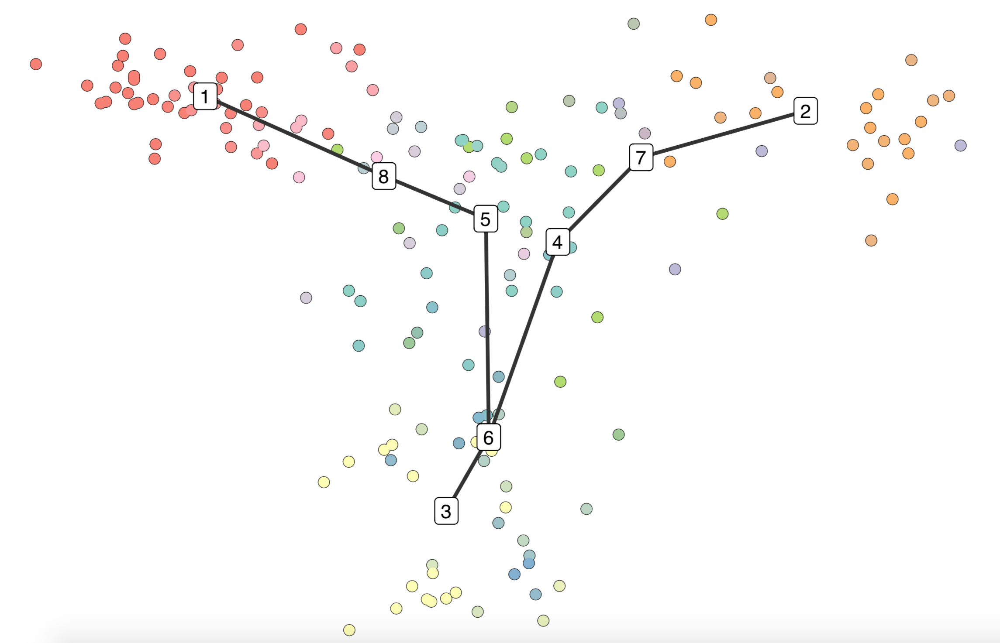
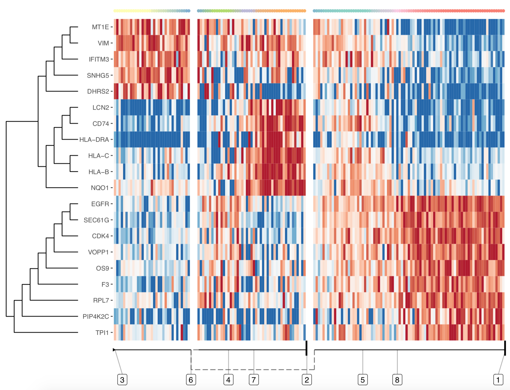
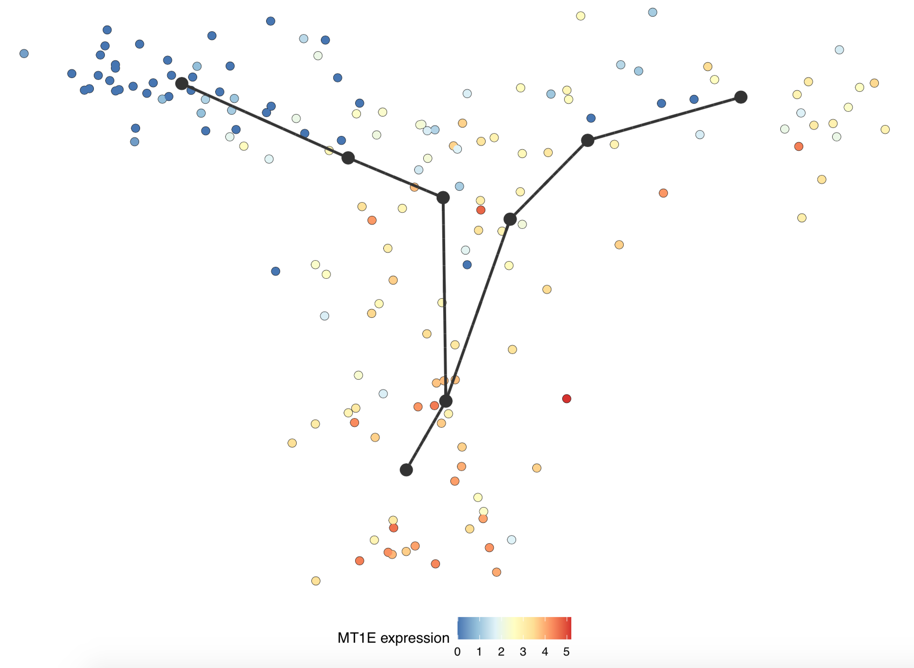

# TinGa

This is a repository hosting the R implementation of TinGa, a trajectory inference method based on the Growing Neural Gas algorithm [1].

[1]: Fritzke, B. (1995) A growing neural gas network learns topologies, _Advances in Neural Information Processing Systems_ 7, 625-632.

## Getting Started

These instructions show how to use TinGa on an example single cell dataset and how to visualise its results using the dynplot package hosted on github (see https://github.com/dynverse/dynplot)

### Installing

TinGa can be used in the dynverse framework (see https://dynverse.org/users/2-quick_start/), which offers a wide range of functions for visualisation of trajectories and genes of interest in single cell datasets. 

TInGa, dynwrap and dynplot can be installed in R as follows:

```
install.packages("devtools")
devtools::install_github("Helena-todd/TInGa/package")
devtools::install_github("dynverse/dynwrap")
devtools::install_github("dynverse/dynplot")
```

### Usage of TInGa, together with dynwrap and dynplot

Any single cell dataset can be wrapped into an object for further use with dyn- packages. Two matrices need to be provided: 
* the counts matrix, of the form cells * features
* the normalised expression matrix, of the form cells * features

We provide an example dataset 

```
data <- dynwrap::wrap_expression(
  expression = TInGa::data_exp,
  counts = TInGa::data_counts)
```

Apply TinGa to the data

```
traj <- dynwrap::infer_trajectory(
  data, 
  method = TInGa::gng_param2(), 
  seed = 42)
```

Visualise the resutling trajectory using dynplot

```
dynplot::plot_dimred(
  traj,
  label_milestones = TRUE)
```


The features that vary the most along the trajectory can be identified and plotted in the form of a heatmap using dynplot. If the trajectory contains branching, the different branches will be represented separately in the heatmap

```
dynplot::plot_heatmap(
  traj, 
  expression_source = TInGa::data_exp)
```


Visualise the expression of one feature of interest in the trajectory

```
dynplot::plot_dimred(
  traj, 
  color_cells = "feature", 
  expression_source = TInGa::data_exp, 
  feature_oi = "MT1E")
```


## Acknowledgments

* to zouter and rcannood for the remarkable dynUniverse they created
* to rcannood for an initial implemenation of the GNG algorithm
