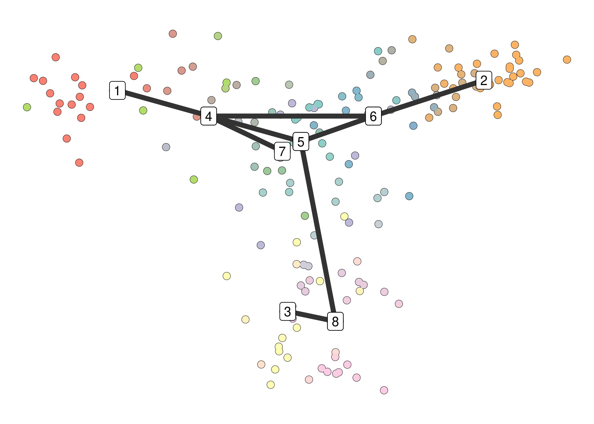
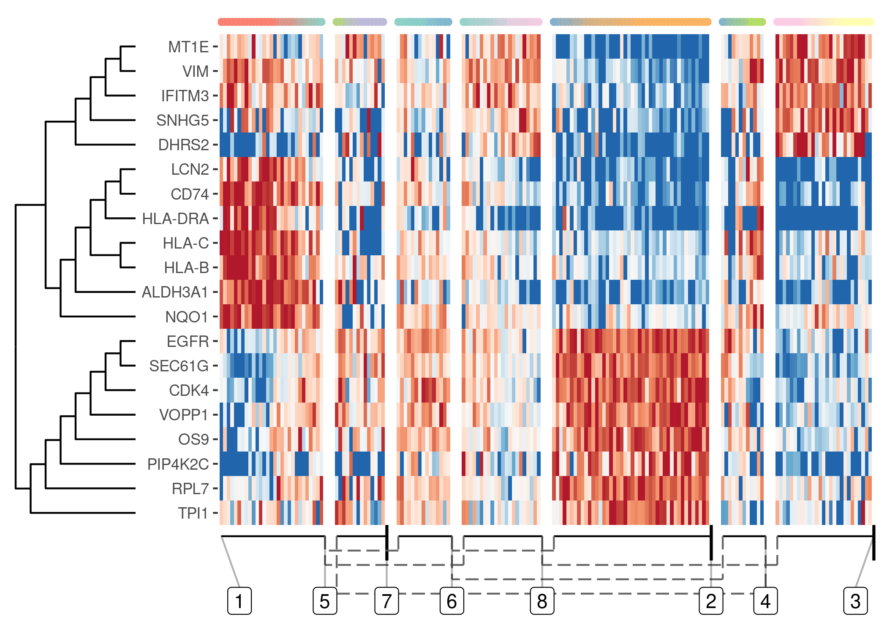
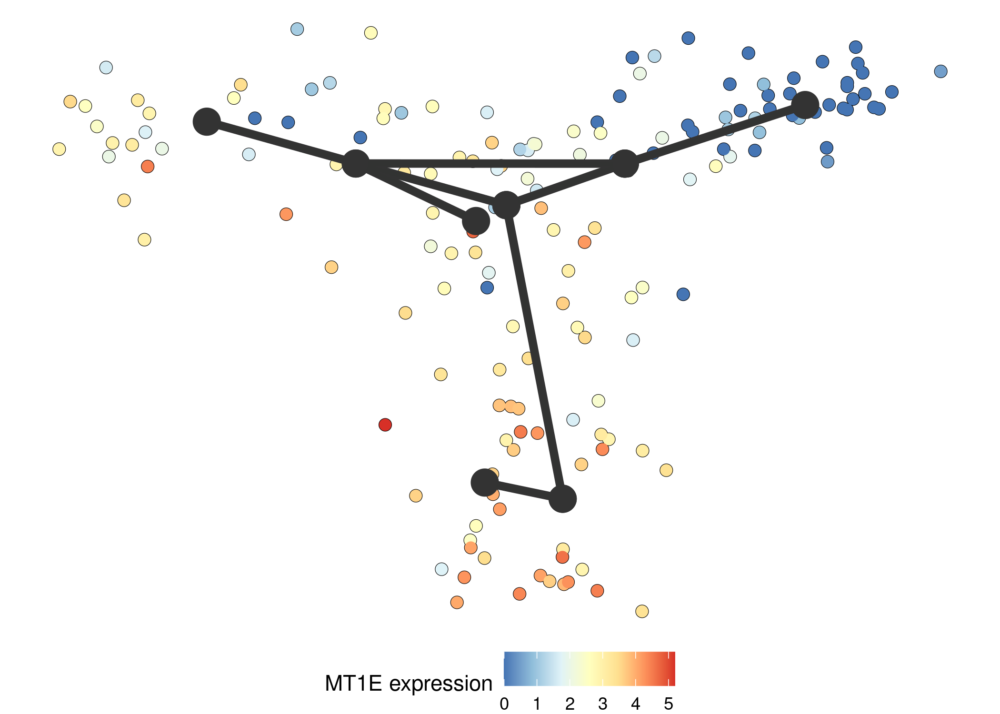

<!-- README.md is generated from README.Rmd. Please edit that file -->

# TinGa

This is a repository hosting the R implementation of TinGa \[1\], a
trajectory inference method based on the Growing Neural Gas algorithm
\[2\].

## Getting Started

These instructions show how to use TinGa on an example single cell
dataset and how to visualise its results using the dynplot package
hosted on github (see <https://github.com/dynverse/dynplot>)

### Installing

TinGa can be used in the dynverse framework (see
<https://dynverse.org/users/2-quick_start/>), which offers a wide range
of functions for visualisation of trajectories and genes of interest in
single cell datasets.

TInGa, dynwrap and dynplot can be installed in R as follows:

``` r
install.packages("devtools")
devtools::install_github("Helena-todd/TInGa/package")
```

### Usage of TInGa, together with dynwrap and dynplot

Any single cell dataset can be wrapped into an object for further use
with dyn- packages. Two matrices need to be provided: \* the counts
matrix, of the form cells \* features \* the normalised expression
matrix, of the form cells \* features

We provide an example dataset

``` r
library(TInGa)
library(tidyverse)
library(dyno)

data <- wrap_expression(
  expression = TInGa::data_exp,
  counts = TInGa::data_counts
)
```

Apply TinGa to the data

``` r
traj <- infer_trajectory(
  data, 
  method = gng_param2(), 
  seed = 42
)
```

Visualise the resulting trajectory using dynplot

``` r
plot_dimred(
  traj,
  label_milestones = TRUE
)
```



The features that vary the most along the trajectory can be identified
and plotted in the form of a heatmap using dynplot. If the trajectory
contains branching, the different branches will be represented
separately in the heatmap

``` r
plot_heatmap(
  traj, 
  expression_source = data$expression
)
#> Warning: `as_data_frame()` is deprecated as of tibble 2.0.0.
#> Please use `as_tibble()` instead.
#> The signature and semantics have changed, see `?as_tibble`.
#> This warning is displayed once every 8 hours.
#> Call `lifecycle::last_warnings()` to see where this warning was generated.
#> Warning: `data_frame()` is deprecated as of tibble 1.1.0.
#> Please use `tibble()` instead.
#> This warning is displayed once every 8 hours.
#> Call `lifecycle::last_warnings()` to see where this warning was generated.
```



Visualise the expression of one feature of interest in the trajectory

``` r
plot_dimred(
  traj, 
  color_cells = "feature", 
  expression_source = data$expression, 
  feature_oi = "MT1E"
)
```



## Acknowledgments

  - to @zouter and @rcannood for the remarkable dynverse packages they
    created
  - to @rcannood for an initial implemenation of the GNG algorithm

## References

\[1\] Helena Todorov, Robrecht Cannoodt, Wouter Saelens, Yvan Saeys
(2020) TinGa: fast and flexible trajectory inference with Growing Neural
Gas, *Bioinformatics* 36 i66–i74,
<https://doi.org/10.1093/bioinformatics/btaa463>.

\[2\]: Fritzke, B. (1995) A growing neural gas network learns
topologies, *Advances in Neural Information Processing Systems* 7,
625-632.
